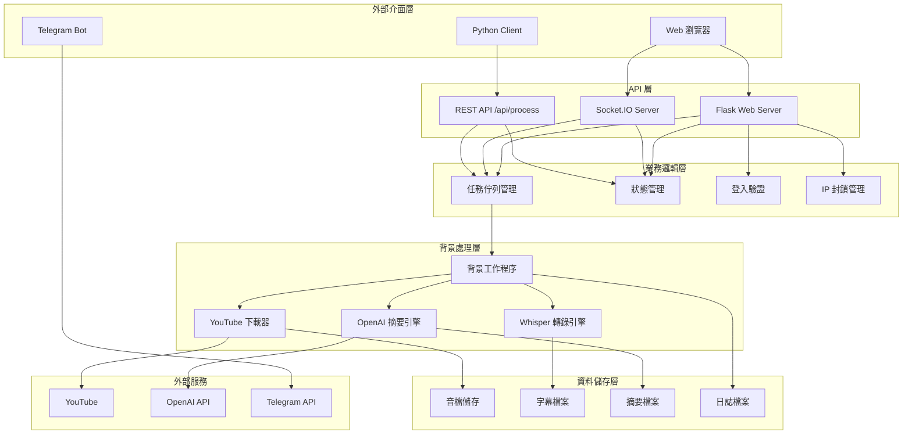
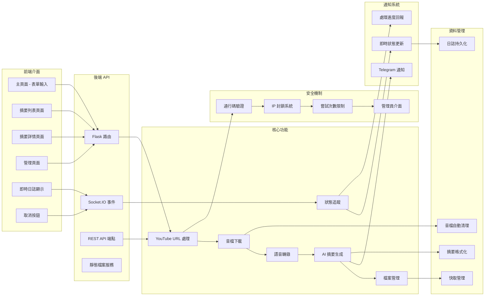
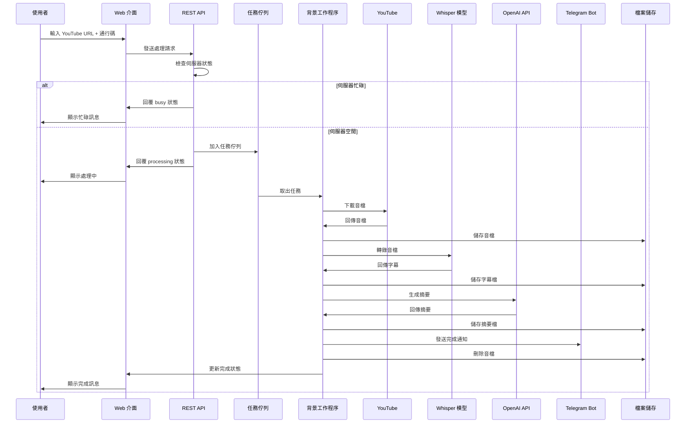
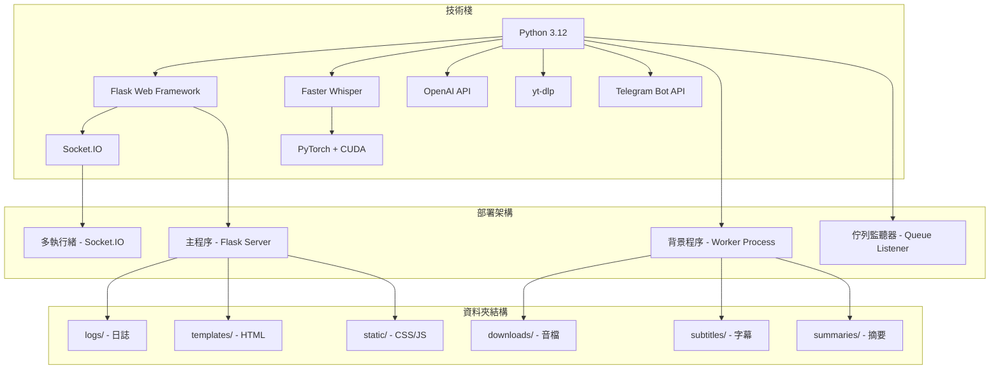
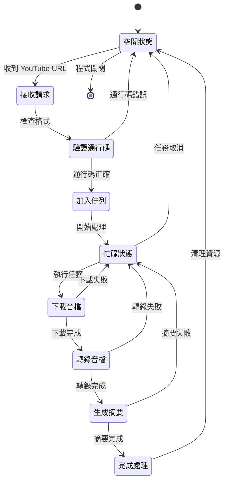
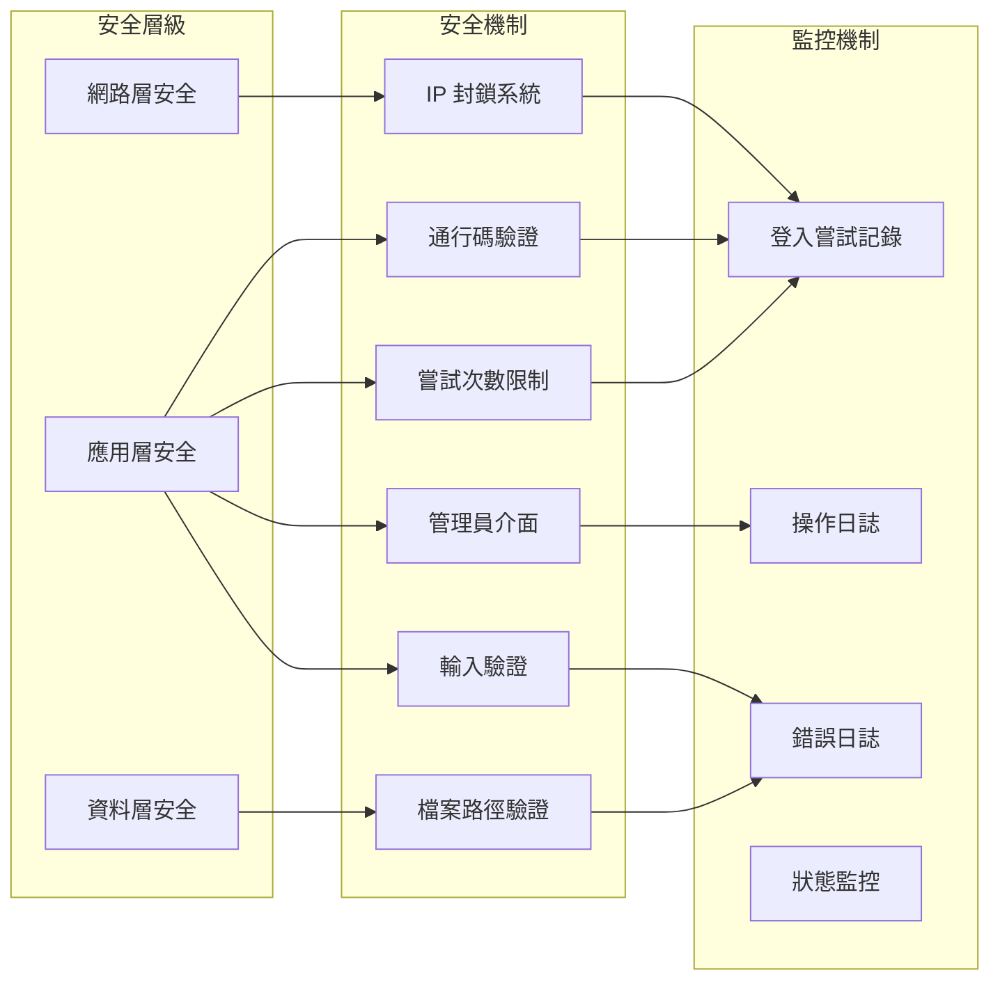

# Whisper WebApp 功能架構圖

## 系統架構概覽

## 詳細功能架構

## 資料流程圖

## 技術架構圖

## 狀態管理圖

## 安全架構圖

## 總結

這個架構圖展示了 Whisper WebApp 的完整功能結構，包括：

1. **多層架構設計**：從外部介面到資料儲存的分層設計
2. **模組化功能**：每個功能模組都有明確的職責
3. **安全機制**：完整的安全驗證和監控系統
4. **可擴展性**：支援多種介面（Web、API、Client）
5. **可靠性**：錯誤處理和狀態管理機制
6. **效能優化**：背景處理和快取機制

整個系統設計注重使用者體驗、安全性和可維護性。 